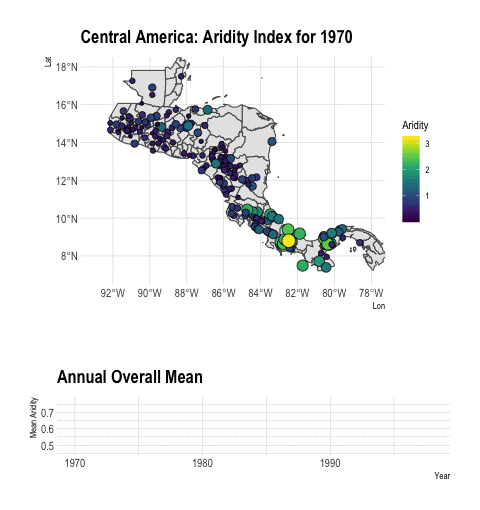
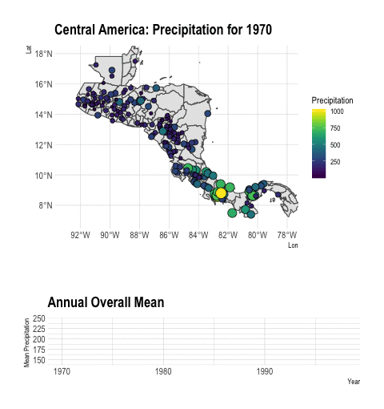

# Aridity Trends in Central America: A Spatial Correlation Analysis

This is the code for [paper reference](https://www.mdpi.com/journal/atmosphere/special_issues/Hydrometeorology). Originally written by [Marcela Alfaro ](https://github.com/malfaro2).

Alfaro-Córdoba M, Hidalgo, H, Alfaro, E (2019) Aridity Trends in Central America: A Spatial Correlation Analysis. To be submitted in Atmosphere. 

Contents:

[Data]()

[Code to read the data]()

[Descriptives]()

[Analysis]()

## Spatial Temporal Visualisation:

Cite:
If you find this code useful in your research, please, consider citing our paper: https://www.mdpi.com/journal/atmosphere/special_issues/Hydrometeorology
